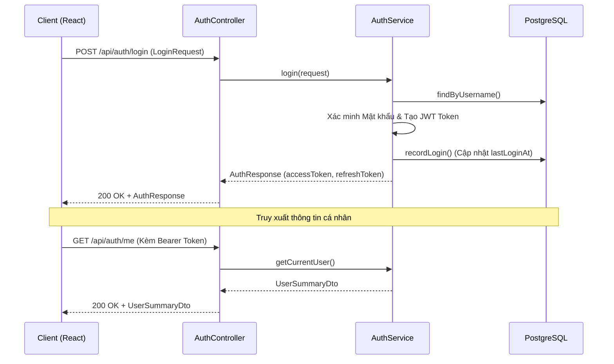
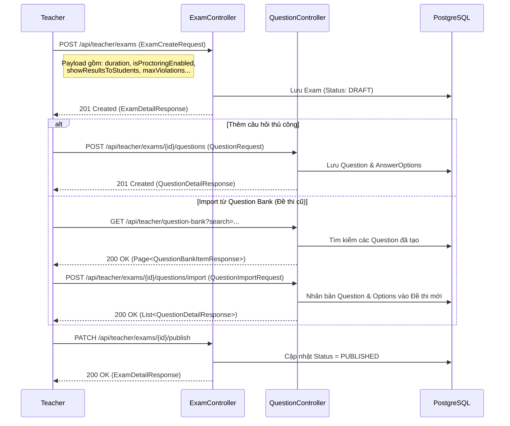
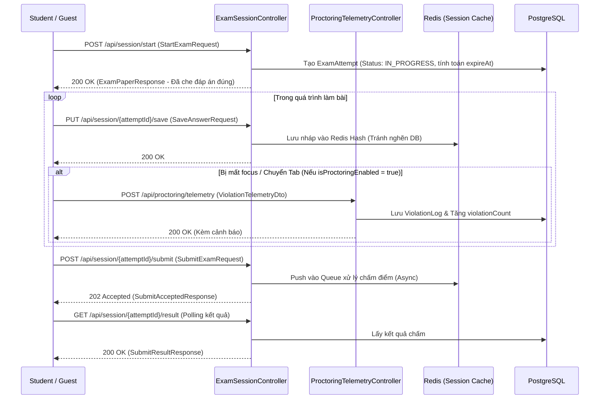
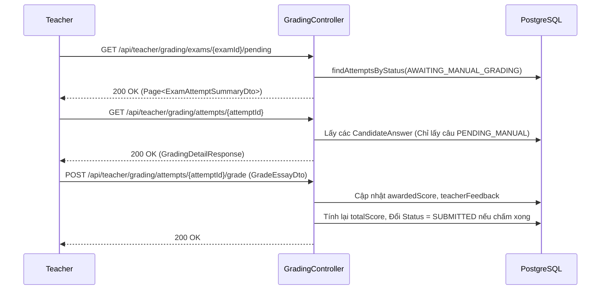
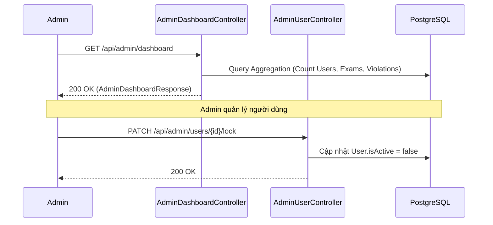

# Tài Liệu Luồng Nghiệp Vụ (System Flows): Hệ Thống Thi Trực Tuyến Quick Test

Tài liệu này mô tả chi tiết các luồng nghiệp vụ dựa CHÍNH XÁC trên các REST API Endpoints, Controllers và logic xử lý hiện tại trong mã nguồn Backend (Spring Boot).

## 1. Luồng Xác Thực và Phân Quyền (Auth Flow)
Ánh xạ theo `AuthController.java` và `AuthService.java`.

---

## 2. Luồng Tạo Đề Thi & Quản Lý Câu Hỏi (Exam Creation & Question Bank)
Ánh xạ theo `ExamController.java` và `QuestionController.java`. Giáo viên tạo đề, cấu hình Proctoring, và lấy câu hỏi từ Question Bank.

---

## 3. Luồng Làm Bài Thi & Giám Sát (Session & Proctoring Flow)
Ánh xạ theo `ExamSessionController.java` và `ProctoringTelemetryController.java`.

---

## 4. Luồng Chấm Điểm Tự Luận Thủ Công (Manual Grading Flow)
Ánh xạ theo `GradingController.java`. Dành cho các câu hỏi dạng `ESSAY_TEXT`.

---

## 5. Luồng Quản Trị Hệ Thống (Admin Dashboard & Management)
Ánh xạ theo `AdminDashboardController.java` và `AdminUserController.java`.

